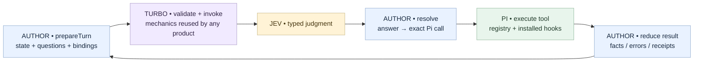
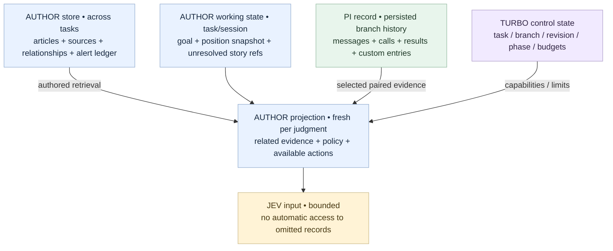
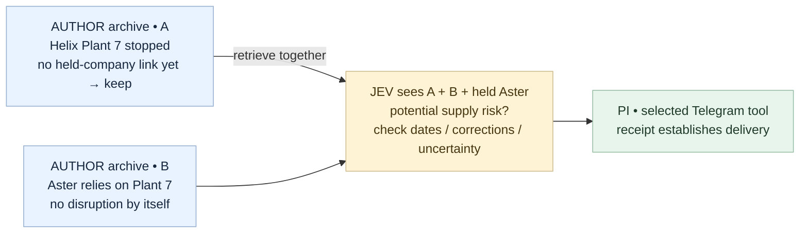
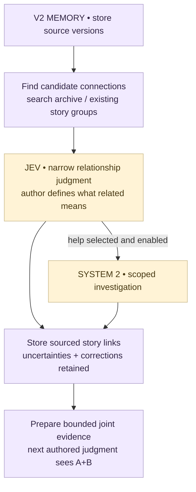
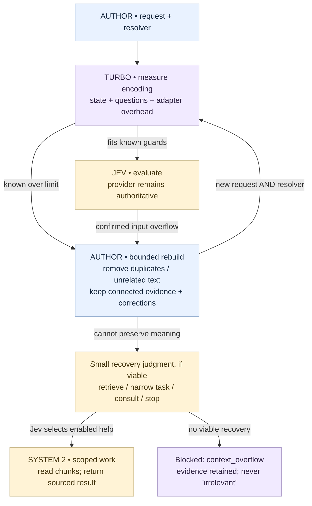
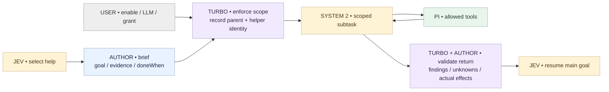

# pi-turbo architecture

Implementation and research updated **2026-10-07**. **Turbo V1 is implemented locally**:
`registerSystem1`, `turbo/auto`, the native Jev Adapter, lifecycle guards and optional
scoped System 2. The [Hyperliquid/news companion](examples/hyperliquid-news/README.md)
is runnable. [Interactive walkthrough](docs/visuals/hyperliquid-news.html).

Native Pi integration, author-state and HTTP-adapter tests pass with substituted
inference/network boundaries. Live Jev accuracy, external delivery and power-loss
recovery remain unverified. Extended/V2 examples below remain explicitly pseudocode.

Start with the diagrams. Details: [news walkthrough](examples/news-agent/README.md),
[Jev research](docs/research/jev-state-and-limits.md), [Pi research](docs/research/pi-integration.md),
[Pi Durable applicability table](docs/research/pi-durable-applicability.md),
and [implementation plan](docs/implementation-plan.md).

For the concrete V1 file layout, author functions and Pi integration, see
[V1 implementation](docs/v1-implementation.md).

## Release scope: V1 first, automatic state management in V2

**V1 assumes the author supplies state and questions within the selected model's
limits.** Turbo runs that prepared decision contract and handles exceptions. It
does not automatically split questions, shrink state, retrieve related evidence,
summarize, or consult System 2 to repair oversized input.

**V2 adds automatic state/context management and an optional story-memory Module.**
The author configures what relationships matter; reusable machinery can find
candidates, ask Jev about connections, retain groups and prepare bounded context.

| Capability | V1 | V2 |
| --- | --- | --- |
| Jev driver, authored request/resolver, native Pi execution | Implemented | Retain |
| User-enabled, scoped multi-tool System 2 handover | Implemented | Retain |
| State/context supplied and updated by author | Required | Still supported |
| Manual read/write/history/context tools | Expose native Pi primitives and author preparation hooks | Retain; add conveniences as needed |
| Turbo control identity, phase, cancellation and stale-reply guards | Implemented; needed for correct execution | Retain |
| Input too large | Explicit exception; preserve state and report failure | Add configured rebuild/recovery |
| Automatic question batching/splitting and context reduction | Deferred | Implement with meaning-preservation checks |
| Turbo application-state/history helpers, semantic checkpoints and automatic maintenance | Deferred; authors can use native Pi/storage directly | Implement |
| Related-evidence discovery, story grouping and retention recipes | Author-provided if needed | Optional reusable story-memory Module |

Control state is the minimum bookkeeping needed to run safely; it is distinct from
automatic management of the application's facts, memory or model context. The
extended news walkthrough and research describe both releases; this table and the
implementation plan determine release scope.

Deferring automatic management does not withhold manual tools: authors retain
`getBranch()`, `appendEntry()`, tool-result details, native context hooks and their
own storage. Turbo's `prepareTurn()` accepts the input they choose. New wrappers
and automatic upkeep are not prerequisites for V1.

## Pi Durable guidance and the host contract

Current target: a **Pi coding-agent extension**. Pi Durable is a separate
experimental harness; its registry, tasks and documents are not interchangeable
with coding-agent extension methods. Adopt its ownership/recovery principles
without claiming its host guarantees. The full
[applicability table](docs/research/pi-durable-applicability.md) records each topic,
owner, release and reason.

**Persisting execution state belongs in V1; automatically selecting or reducing
model context remains V2.** V1 records task/attempt/branch/phase identity, stops
owned helper work on cancellation, rejects stale returns, and preserves known
effects. Authors own state schemas, receipts, deduplication and reconciliation.
An interrupted external call has an unknown outcome until evidence resolves it;
submission deduplication alone does not make that effect exactly-once.

Native entries support restore bookkeeping, not an automatic promise to resume
every interrupted task. If unattended crash continuation is required, evaluate the
actual host before implementation; use host machinery rather than adding a durable
scheduler to Turbo. Durable adoption would also require a new model/hook/context
compatibility spike. No dependency or runtime migration has been made.

## Goal and agreed ownership

One installable Pi extension makes Jev the ongoing decision driver. An optional,
user-enabled System 2 LLM handles scoped planning, generation, research, or tool
work, then returns to Jev. The main goal remains with System 1.
Generative LLM work in Turbo belongs to this explicit System 2 capability, rather
than an implicit model call on every article or turn.

The news/Telegram agent and ticket agent are **independent products** with separate
integrations, sessions, state, tools, and policies. They reuse Turbo. Installing
tools alone does not define either agent's decision space.

| Color / owner | Responsibility |
| --- | --- |
| Blue — author | Goals, state schema, retention/retrieval, questions, criteria, action descriptions, bindings, reducers, completion and consultation policy. |
| Purple — Turbo | V1: model/host Adapter, control phase, exception reporting, stale-result guards, cancellation, accounting and bounded helper transport. V2: application-state/history helpers and configured memory/context management. |
| Green — Pi | Session tree, transcript, tool registry/execution, extension hooks/lifecycle, models and credentials. |
| Amber — models | Jev answers authored typed questions; enabled System 2 performs its scoped subtask. |
| Gray — operator/user | Enable System 2, select available models, grant tools/scope, set operational ceilings. |



**Why Turbo exists:** Pi runs tools; Jev judges. Turbo's deep Module connects them
and hides reusable lifecycle and handover mechanics behind a small Interface in
V1. V2 adds configurable memory/context machinery. Authors retain product semantics
without domain branches in the core. Pi already continues after tool results; retain that loop.
[Pi execution model](https://pi.dev/docs/latest/how-pi-works).

## What Jev fundamentally does

Treat each evaluation as self-contained: send relevant evidence again and ask
typed questions. The reviewed contract has no conversation-memory handle; this is
an API inference, not a server retention guarantee. Jev returns choices, scores,
or yes/no probabilities, not newly written alert text.
[Contract evidence](docs/research/jev-state-and-limits.md#what-jev-receives-and-remembers).

One question can compare **several articles in the same state**. Questions in one
call cannot read one another's answers. Dependent judgments need another call.
Code performs exact ID joins and time checks; ambiguous relationships need tested
Jev judgments or enabled System 2. Confidence does not establish source truth or
retrieval completeness. [Model limitations](https://docs.typesafe.ai/model-jaggedness/jev-1.13).

## State: author-managed in V1, automatic helpers in V2

In V1, the author prepares the complete bounded input and updates application state
from actual results. Authors may store it in files, a database or native Pi custom
entries. Turbo does not choose what to retain, discover relationships or maintain
a smaller projection automatically. The diagram shows authored data flow in V1;
V2 can supply optional helpers for those operations.



| State | Management |
| --- | --- |
| Domain evidence | Author-selected file/DB/service; immutable source versions, provenance, indexes and retention. Supports correlation across tasks/sessions. |
| Author working state | V1: author-managed schema, storage, reducers and migrations. V2: optional Turbo persistence/maintenance helpers backed by Pi custom entries. |
| Turbo control state | Separate namespace; integration/task/branch/revision, helper identity, phase and counters. |
| Pi transcript | Native execution record in V1; reusable paired history views are V2. Failed/unknown outcomes remain explicit in both. |
| Jev projection | Rebuilt for the next judgment. Includes evidence content/excerpts; IDs alone do not load records. |

Pi's `appendEntry()` and branch access support persistence. Custom entries do not
enter model context automatically. V1 Turbo reconstructs its control record on
load/resume/branch navigation; the author reconstructs application state. V2 adds
application-state helpers. [Session format](https://pi.dev/docs/latest/session-format).

V2 proposed helpers: `state.get/set`, `history.recent/read/resetWindow`, and
`context.measure`. These are **not exported implementations** or V1 requirements.
Author code supplies meaning; any automatic reduction or semantic maintenance is
explicitly configured V2 behavior.

<details>
<summary>Persistence, resets, concurrency and freshness</summary>

V1 retains the control guards below. Application persistence, migrations, retention
and freshness remain author responsibilities; V2 may provide configured helpers.

- Pair each request and resolver with task/branch/revision. Stale replies may be
  audited but must not execute against newer bindings or another task.
- Apply events once using stable IDs. Serialize one active task's transitions.
  The companion extension owns ingress and bounded queues; new RSS input cannot
  replace a task underneath an in-flight decision/helper.
- **Task history window ≠ domain evidence window.** Resetting the former retains
  related articles, unresolved stories and delivery receipts at their chosen scope.
- Author-owned migrations handle schema changes. Unsupported versions stop with
  diagnostics rather than resetting to apparently empty, successful state.
- Cached positions carry time/revision; the author defines refresh policy.
  Preserve corrections, superseded claims and unresolved contradictions.
- Cross-store writes are not automatically atomic. Use event IDs, recoverable
  writes and idempotency where supported. Unknown send outcomes need reconciliation.
  Pi branch navigation does not undo an external effect.
- At storage/queue limits, apply explicit retention/backpressure. Preserve required
  unresolved evidence or visibly stop ingestion. Expose expired/missing coverage.

</details>

## News: two weak signals can form one useful story

Synthetic case; **expected policy behavior, not measured Jev output**:



**No alert yet is not forget.** On B, author retrieval searches the archive for the
new supplier/plant link. Keep A+B, timestamps and source excerpts together.
Per-article relevance filtering could lose A. Bounded retrieval can still miss
links; expose omissions and evaluate recall. See the [news walkthrough](examples/news-agent/README.md).

V1 can demonstrate this with an author-supplied A+B packet. Automatic discovery of
the connection and maintenance of story memory belong to V2.

## V2: optional story-memory Module

Authors should not need to implement every storage/search/grouping operation from
scratch. An optional Module can provide reusable machinery while the author defines
what a useful connection means for their agent. The news recipe is one configuration
of that Module; it does not add news-specific policy to Turbo's core.

```ts
// V2 proposal; pseudocode, not an exported Interface.
storyMemory({
  relatedWhen: "Same event, supplier dependency, or correction",
  alertWhen: "Combined evidence materially affects a held position",
  retention: "Author-configured horizon and pinned unresolved stories",
  whenUnclear: "Offer consultation if user-enabled System 2 is available"
})
```



The Module supplies candidate retrieval, typed relationship questions, source-linked
groups, retention and context assembly. The author supplies relationship criteria,
alert policy and storage choices; the operator grants models/tools/work ceilings.
`whenUnclear` cannot enable a helper or bypass permissions.

For A/B: retain the Helix outage without an immediate alert; when B introduces the
Aster–Helix dependency, search for Helix, ask Jev whether the supplied sources
connect, and retain A+B as a group. Context reduction keeps the connected evidence
together. Corrections update claim status while preserving original sources/receipts.

Search can miss candidates; a Jev judgment cannot recover evidence it never saw.
Keep coverage/omissions visible, test retrieval recall and joint-evidence quality,
and use configured System 2 for difficult connections when selected. No automatic
claim of completeness or truth. This entire Module is **V2 work**.

## Configuration and limits

| Knob | Who chooses it? | At the limit |
| --- | --- | --- |
| Retention, retrieval horizon, story grouping | V1 author; V2 configured memory Module | Explicit policy; missing coverage stays visible. |
| Fields/excerpts for each judgment | V1 author prepares fitting input; V2 may assist | V1 exception; V2 configured rebuild preserves decisive relationships. |
| Optional encoded-request byte cap and size breakdown | V2 operator/author; Turbo enforces | Diagnostics and configured recovery. Bytes are not tokens. |
| Actual Jev limits | Selected backend/model | V1 assumes compliance and handles exceptions; V2 adds measurement/management. |
| Task/helper calls, deadlines, spend | Operator ceilings; author may narrow | Explicit exhausted/incomplete outcome; no automatic increase or helper ping-pong. |
| Pi compaction | Native lifecycle integration | V1 explicit auxiliary handling/unsupported outcome; V2 configured checkpoint/summarization. Never selects domain actions. |

Current TypeSafe documentation for `jev-1.13.0` requires **both**:

```text
state + all questions combined ≤ 64k tokens
state + longest question      ≤ 32k tokens
```

A 30k state + 3k question fails the second constraint even below the first.
This is not a universal 64k conversational memory. Operators can leave backend
ceilings to Turbo; evidence policy still needs an author.
[Published limits](https://docs.typesafe.ai/models).

No exact preflight tokenizer/count endpoint was found in the reviewed contract.
V1 handles provider exceptions without claiming exact preflight admission. V2's
measurement reports complete encoded bytes, labeled token estimates and overhead
uncertainty. Both record available actual usage/resolved model identity.
[Measurement gaps](docs/research/jev-state-and-limits.md#documented-limits-and-measurement).

### V1: assume fitting input; handle the exception

```text
Author supplies prepared state + questions + resolver
  → Turbo validates the decision protocol and invokes Jev
  → success: resolve answer and continue through Pi
  → recognized input overflow: explicit context_overflow failure
  → unclassified provider error: preserve error classification/details
```

Preserve author state and pending work. Do not emit a domain action or success from
a failed call. Do not retry the unchanged oversized request indefinitely, silently
truncate, split questions, rebuild state, or invoke System 2 to repair overflow.
The author/operator may explicitly correct the input and start a new attempt.
`context_overflow` is a proposed Turbo error classification, not an invented HTTP
status; only use it when the failure can be identified reliably. Handle failed
classifier result statuses as well as thrown exceptions; skip the author resolver
on either. Pi can compact/retry overflow, so the V1 integration must guard that
path and terminate the unchanged attempt, not merely catch the classifier call.
[Concrete failure design](docs/v1-implementation.md).

### V2: configured overflow recovery



Bound rebuild/recovery attempts. A recovery question asks how to obtain adequate
input, not whether omitted news is relevant. Preserve unknown provider error
classification; do not invent an overflow error code. System 2 also has finite context.

V2 can split independent question batches when only the aggregate limit is exceeded;
each batch must still fit state plus its longest question and preserve answer bindings.
Splitting questions cannot fix a single oversized state/question pair. Reduction,
chunking, recovery judgments and semantic memory management are also V2.

Pi compaction is separate from Jev projection. V1 must guard auxiliary requests and
report unsupported Turbo compaction explicitly without changing other models' behavior.
V2 adds configured checkpoints and any explicitly enabled System 2 summarizer.
A small Jev payload does not bypass Pi's earlier compaction checks.
[Compaction design](docs/research/pi-integration.md#compaction-and-auxiliary-requests).

## Built-in, optional System 2

Turbo supplies the reusable handover mechanism; the user enables/configures it.
This is **V1 work** for authored reasoning/tool subtasks; automatic state/context
maintenance and overflow-triggered recovery are V2.
Within grants/budgets, Jev can choose consultation whenever the authored judgment
calls for it. No core confidence cutoff or mandatory planning stage. The author
binds Jev's selected intent to a brief; Jev does not generate that brief as free text.



Implemented split: operator grants maximum model/tools/work and time ceilings; author supplies the
product brief and requested subset; Turbo enforces their intersection with Pi
availability/hooks. The Hyperliquid companion grants source reads only. Other authors can request explicitly
granted effects and must preserve their receipts and reconciliation policy.

<details>
<summary>Handover semantics — implemented Interface linked below</summary>

```ts
// AUTHOR: pseudocode, not exported APIs.
prepareHelp(state, intent) => ({
  goal, inputs, doneWhen, requestedTools, argumentScope, resultShape
})
applyHelp(state, result) => nextState

// TURBO: control identity; PI persists tool execution.
helper = { taskId, branchId, revision, callId, phase, budget }
result = { status, findings, sourceRefs, uncertainties, effects, usage }
```

- One active helper per task initially, no recursive delegation. Retain the main
  goal and define the subtask's return condition.
- S2 can use several allowed tools through Pi. Validate tool/argument/resource
  scope and installed hooks. Generated text does not grant permission.
- Separate proposals from actual effect receipts; return any authorized effect
  so Jev does not perform it twice. Validate structure/provenance mechanically;
  semantic correctness still requires authored checks and model evaluation.
- Success, incomplete, denied, exhausted and error return distinct evidence if
  the parent remains active. A plain LLM final response is not proof of success;
  missing structured handback needs an explicit recovery path.
- Parent cancellation aborts work without restarting Jev. Late task/branch/revision
  replies cannot apply. On resume, reconcile unknown external effects.
- Cancellation must reach the underlying work, not just its waiter. Keep a pending
  cancellation explicit until owned work terminates; retain any recorded effects.
- Helper completion is not main completion. Jev judges the next action/outcome.
  V2 summarization is separately configured within the enabled System 2 capability;
  enabling consultation does not enable a silent summarizer. Unrelated Pi extensions
  retain their own explicitly configured capabilities.

</details>

## Native Pi integration — implemented transport

Tested with **Pi coding-agent 1.0.4**, using the host's public APIs. The virtual
model routes to Turbo's chat-shaped Adapter; the Adapter invokes native
`ctx.modelRegistry.classify()` and emits ordinary assistant/tool messages.
Classifiers are not selected directly as chat models. Pi owns continuation.
[Native facilities](docs/research/pi-integration.md#verified-facilities).

```text
/model turbo/auto — native virtual selection
  → Turbo System 1 Provider → Pi classifier → Jev → authored resolve
    → ordinary Pi tool → actual result → next authored judgment
    → turbo_consult → isolated native Pi Agent → physical LLM
         → forwarded ctx.executeTool → parent validation/hooks/effects
         → turbo_finish or explicit incomplete/error → Jev resumes
  direct / summary → explicit unsupported error; no business judgment
```

**Transport decision:** the earlier same-session S2 phase router remains a design
alternative, not the implementation. An isolated `pi-agent-core` Agent gives the
helper an explicit brief and its own context/lifetime. It is neither a bespoke
agent loop nor a separately durable `AgentSession`. Turbo forwards helper domain
calls through the parent `ctx.executeTool`, records the helper transcript/results
as custom entries, and propagates cancellation before awaiting idle. Tests observe
those boundaries; they do not establish every possible third-party hook combination.

Factory registration uses `registerProvider`, `registerVirtualModel`, `registerTool`
and versioned `pi.events` discovery. Both companion load orders work. Resources
initialize on `session_start` and close on `session_shutdown`; reload rediscovers
author functions. Helpers use Pi's configured physical models and credentials.
[Extension contracts](https://pi.dev/docs/latest/extensions),
[virtual models](https://pi.dev/docs/latest/virtual-models).

Helper tool access intersects operator grants, author argument scopes and native
availability/hooks. Approved argument objects are frozen before subsequent hooks;
hooks can deny calls but cannot rewrite those objects into another binding. This
is a cooperating-extension contract, not isolation against malicious installed code.

Turbo records returned classifier identity/usage and helper model usage. Pi adds
nested tool usage to the parent result; Turbo does not add it twice. Unknown provider
pricing is not a claim of free execution. Dollar spend ceilings are not implemented;
current limits are steps, helper turns/tool calls and elapsed time.

A restored unfinished control record becomes an interruption error, retaining its
pending call. A new explicit attempt re-prepares author state. The Hyperliquid
companion blocks on pending/unknown alerts in its independent file ledger. Native
branch navigation never rolls back that external ledger.

## Open decisions and proof required

| Decision | Current position |
| --- | --- |
| Helper transport | Implemented native Agent inside a model-only consultation tool, forwarding domain calls through parent Pi hooks. |
| Host and crash recovery | Coding-agent target; prove restore limits. Evaluate Durable before promising unattended continuation; this is separate from V2 context automation. |
| Public Interface | Implemented in `src/contracts.ts`; local experimental package, not a versioned public release. |
| State format | V1 control record + author-managed application state; V2 state helpers/checkpoints/migrations. |
| S2 default grant | Disabled by default. News companion requests exact source reads only. |
| Context management | V1 fitting-input assumption and explicit exceptions; V2 measured diagnostics, batching and configured recovery. |
| Story-memory Interface | V2 optional Module with author-defined relationships/policy; exact configuration still draft. |
| Model reliability | V1 supplied-evidence judgments/S2 need evaluation; V2 retrieval, grouping and compression need additional evaluation. |

For each change show the next judgment, field rationale, before/after meaning,
execution evidence and missing model validation. Small input alone is not efficiency.
Measure accuracy, model identity, whole-task latency/cost and usage.

Outcomes stay **completed / waiting_input / blocked / cancelled / error**; Pi idle
proves none of them. Native tests exercise independent counter/helper integrations and the real news companion
through the same core. The ticket product remains a separate design example.
See [implementation gates](docs/implementation-plan.md).
