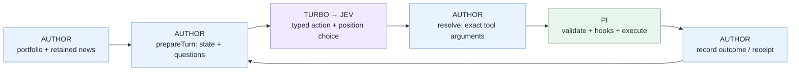

# Build a Hyperliquid portfolio + news watcher

**Runnable V1 companion for Pi 1.0.4.** You configure this agent; Turbo stays generic.
[Interactive walkthrough](../../docs/visuals/hyperliquid-news.html) ·
[Extension implementation](index.ts) · [Public Turbo Interface](../../src/contracts.ts).

## 1. Run in preview mode

From the `pi_turbo` checkout, with Node ≥22.19:

```sh
npm ci --ignore-scripts
npm run build
cp examples/hyperliquid-news/news.example.json news.local.json
cp examples/hyperliquid-news/turbo.example.json turbo.local.json
```

Edit `news.local.json`: put **your public account/subaccount addresses** in `wallets`
and your chosen public HTTPS RSS/Atom URLs in `feeds`. Empty values deliberately
stop with a configuration message. You can instead set `HYPERLIQUID_WALLET` for one
account. Only the listed accounts are covered; subaccounts are not discovered.

Make `TYPESAFE_API_KEY` available through your environment or configure TypeSafe
in Pi's credential store. Turbo uses Pi's native classifier and credential lookup.
The selected Jev alias is recorded with the provider's returned model identity.
[Pi classifier support](https://pi.dev/docs/latest/models#use-classifier-models).

```sh
./node_modules/.bin/pi --no-extensions --no-builtin-tools \
  -e . -e ./examples/hyperliquid-news/index.ts \
  --model turbo/auto --turbo-agent hyperliquid-news \
  --news-config news.local.json --turbo-config turbo.local.json
```

In Pi, run `/news-check`. Inspect the `news_alert` tool result or
`.pi/hyperliquid-news.json`: previews contain the actual message text and
`status: "preview"`; **no Telegram call is made**. Use the project binary:
the globally installed Pi may be older than the tested 1.0.4 API.

<details>
<summary>What each configuration owns</summary>

| File / setting | Owner | Meaning |
| --- | --- | --- |
| `news.local.json` | Agent author / operator | Accounts, feeds, policy, state path, explicit evidence window and destination. |
| `turbo.local.json` | Operator | Classifier, optional helper, work/time ceilings. |
| `index.ts` | Agent author | Questions, state preparation, exact action mappings, alert template. |
| `adapters.ts` | Agent author | Read-only Hyperliquid `/info`, RSS, source reads and Telegram delivery. |
| `state.ts` | Agent author | File schema, lock, atomic replacement, exposure revision and delivery ledger. |
| `src/` | Turbo | Reusable Jev-to-Pi bridge and scoped helper mechanics. No Hyperliquid/news rules. |

`perpDexs: "all"` discovers HIP-3 DEXs plus native perps. To narrow coverage, supply
an explicit array; native is `""`. `includeSpot` adds nonzero spot balances.
Positions preserve decimal strings, direction and source coverage. This is an
**exposure inventory**, not a consolidated NAV calculation: spot valuation, open
orders, vault look-through and account discovery are outside this companion.
[Perpetual endpoints](https://hyperliquid.gitbook.io/hyperliquid-docs/for-developers/api/info-endpoint/perpetuals),
[spot balances](https://hyperliquid.gitbook.io/hyperliquid-docs/for-developers/api/info-endpoint/spot).

</details>

## 2. Understand one check

🔵 Author · 🟣 Turbo · 🟢 Pi · 🟠 Models



Small pseudocode; the linked files contain the executable TypeScript:

```ts
// AUTHOR — index.ts
prepareTurn(ctx) {
  cycle = readFromPiBranch(ctx.attemptId)
  state = readAuthorFile()
  evidence = previousArticles(23) + currentArticle
  return { request: { state: { portfolio, evidence }, questions }, resolve }
}
resolve(answers) {
  // IDs and arguments come from this exact snapshot, not model-written JSON.
  return tool("news_alert", { cycleId, articleId, position: chosenIndex })
}
// AUTHOR tool, executed by PI
news_alert(binding) {
  recheckPositions()
  saveDeliveryIntent()
  receipt = sendTelegram(template(binding))
  saveActualReceipt(receipt)
}
```

The current article and focus are **independent questions** over the same evidence.
They cannot read each other's answers. An alert without a supported position stops
explicitly. Jev doesn't write notification prose; this companion uses a source-link
template. It alerts on one most affected position per article version.

## 3. A alone versus A+B

Synthetic scenario, not measured Jev output:

```text
A: “Orion operator is down”       B: “Held network depends on Orion”
   ↓ author's skip judgment         ↓ next judgment sees A + B + positions
retain A in the author file       alert / defer / read more with System 2
```

| State layer | Stored where | What happens next |
| --- | --- | --- |
| Articles, review keys, alert receipts | Author's `stateFile` | Survive checks, Pi sessions and branch changes. |
| This check's portfolio and progress | Pi custom entry `hyperliquid-news/cycle-v1` | Rebuilt from the selected branch; a new attempt fetches fresh evidence. |
| Attempt, phase, pending call, counters | Turbo's Pi custom entries | Interrupted work becomes explicit error; no automatic replay. |
| Jev's next input | Author's `prepareTurn` | Current article + up to 23 earlier articles + portfolio + optional findings. |

**Skip means reviewed, not forgotten.** The author retains articles for 48 hours
and selects a chronological window of 24 articles, by default. Omitted counts and
truncated excerpts are explicit. This is a simple authored policy, not semantic
story retrieval: related evidence outside that window will not reach Jev. Change
`contextArticles`, `retentionHours`, `excerptChars` or the selection function yourself.
Review/receipt records are retained; archive/migrate those deliberately as the file grows.

**If the resulting input exceeds the model limit:** Turbo records the error, skips
resolution and stops that attempt. It does not shrink, summarize, split or silently
invoke an LLM. Adjust the author input and explicitly run another check. Likewise,
when Pi needs compaction, Turbo V1 declines it; create a fresh Pi session while
retaining the author file. Automatic context management remains V2.

<details>
<summary>Freshness, duplicates and uncertain sends</summary>

- Feed corrections receive new immutable version IDs. Failed feed or account reads
  block the check; they never become “no news” or “no positions”.
- Every send re-fetches the configured portfolio. A changed exposure blocks the
  old binding; start another check. Freshness is still a snapshot, not a guarantee
  against a change immediately after the read.
- The ledger key includes article version, exposure revision, policy and preview/live
  mode. An acknowledged send isn't repeated under that key. Semantic duplicates
  across different source articles are a Jev/policy judgment, not exactly-once delivery.
- A transport failure after sending is `unknown`. All new alerts stop until you
  check Telegram and use `/news-resolve <effectKey> sent <receipt>` or
  `/news-resolve <effectKey> not-sent`. The latter permits a future retry.
- A crash may leave `stateFile.lock`. Check that the old process is stopped and inspect
  its pending delivery before removing **that lock**. No automatic stale-lock takeover.
- Atomic file replacement and saved Pi entries are separate from the external HTTP
  effect. Branch navigation cannot undo delivery. Power-loss durability is not claimed.
- Concurrent writers to one file are rejected. Use one watcher per ledger/destination.

</details>

## 4. Enable optional System 2

Replace `system2` in `turbo.local.json` with your **available physical chat model**:

```json
{
  "enabled": true,
  "model": { "provider": "YOUR_PI_PROVIDER", "id": "YOUR_PHYSICAL_MODEL_ID" },
  "tools": ["news_article"],
  "maxTurns": 6,
  "maxToolCalls": 8,
  "timeoutMs": 60000
}
```

Set both model fields from Pi's available models and configure its credentials.
Restart Pi after editing flags/configuration. The placeholders are not model IDs.
The total Turbo attempt deadline also applies to the helper.

```text
JEV chooses help → AUTHOR binds exact source IDs
  → TURBO starts isolated native Pi Agent
    → LLM reads permitted sources through parent Pi hooks (several turns)
    → turbo_finish(findings, sources, uncertainties)
  → AUTHOR includes returned evidence → JEV decides again
```

This companion grants source reading only. The helper cannot send Telegram, trade,
open arbitrary source IDs or complete the parent check. Natural text without
`turbo_finish` is incomplete evidence. Cancellation stops owned helper work and
awaits it; a tool that ignores abort can delay settling. Grants constrain native
tool calls, not arbitrary malicious code in installed extensions.

## 5. Turn on delivery and watch

After checking previews, set `mode: "telegram"` and `telegramChatId` in
`news.local.json`, supply `TELEGRAM_BOT_TOKEN` through your environment, and restart.
The bot must already have access to the target chat. There is no trading/signing key.
Telegram success requires an actual `sendMessage` receipt.
[Telegram API](https://core.telegram.org/bots/api#sendmessage).

```text
/news-check          one check
/news-watch 300      check every five minutes while this Pi process is open
/news-watch stop     stop polling
/pi-turbo           inspect selected integration, phase and outcome
```

Polling starts with a check, skips busy periods, and pauses on a blocked check or
model/context failure. Correct the cause and explicitly restart `/news-watch`. It
also stops on model switch, reload or shutdown. It does not run after Pi exits, and has no durable scheduler. Preview
and live keys differ: switching to Telegram can alert on retained articles already
previewed. Starting a watch is explicit; installing the package starts nothing.

## Evidence

The tests execute the actual Turbo, companion, Pi loader/session/tool hooks and
file ledger. Inference and HTTP boundaries use test doubles, including A-skip →
A+B-alert, stale positions, invalid input, helper cancellation and uncertain sends.
They prove plumbing and state semantics, **not Jev's relevance accuracy**.

Before relying on live alerts, evaluate A alone, B alone, A+B, corrections,
contradictions, repeated claims, stale/closed positions and long/short exposures
with your configured model and feeds. No live wallet read, Jev classification,
helper call or Telegram delivery was performed for this implementation task.
