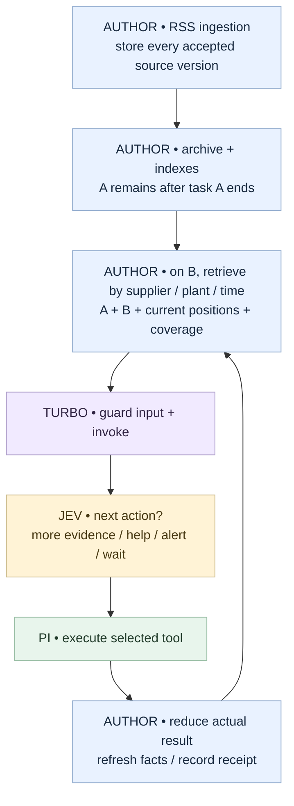

# News → position relevance → Telegram

**Design walkthrough, not an executable agent.** Names, articles, budgets and
outcomes below are synthetic. No model decisions or Telegram sends were performed.
This agent has its own Pi session and state, independent of the ticket agent.

**Release scope:** V1 authors supply fitting context and manage storage, retrieval
and state themselves, using native Pi tools or their own code. The V1 core can be
demonstrated with a supplied A+B packet. Automatic memory/overflow recovery below
is V2 design. See [the concrete V1 Interface](../../docs/v1-implementation.md).

## First: three articles over time

| Arrives | Evidence | Intended next judgment |
| --- | --- | --- |
| A | Helix Plant 7 stopped; an initial report estimates ten days to restart. | No supplied link to a held company yet. Retain the source for later matching; no alert just for this fact. |
| B | Aster Motors depends on Helix Plant 7 as its sole battery source. Current positions include Aster. | Retrieve A. A+B can support a potential supply-risk alert; verify identity, timing, uncertainty and corrections. |
| C | A later correction says Plant 7 restarted and supersedes the initial restart forecast. | Reassess the story. If an alert was sent, decide whether a sourced update is material. |

**B alone has a dependency but no disruption. A alone has a disruption but no known
position link. Their combination is the useful input.** A duplicate of A is not
independent corroboration; a report about Plant 9 must not be joined to Plant 7.



Blue = author; purple = Turbo; green = Pi; amber = model judgment.
The diagram shows an authored design, not an observed execution trace.

## What lives where

| Place | Example state | Who supplies meaning? |
| --- | --- | --- |
| External news store | Full sources A/B/C, hashes/versions, source timestamps, entity/plant indexes, claim provenance, alert ledger | Author |
| Pi custom entries or author store | Active goal/task, story references, position snapshot/revision, last result, pending helper/result refs | V1 author schema/reducer/persistence; V2 may add Turbo helpers |
| Turbo control record | Integration ID, task ID, branch, revision, S1/S2 phase, helper call ID, limits/counters | Turbo |
| Fresh Jev input | A+B excerpts, held Aster, uncertainty/corrections, policy and currently bound actions | Author projection |
| Pi transcript | Selected calls and actual results; branch history | Pi |

Starting a new article task resets its recent execution window, **not** the archive
or unresolved stories. A source reference helps code retrieve content; Jev cannot
open an ID unless the content is supplied in a subsequent evaluation.

<details>
<summary>Small state snapshot after B</summary>

This is a proposed application shape, not the Jev HTTP schema or an exported Turbo type.

```ts
news = {
  schemaVersion: 1,
  task: { id: "article-B", goal: "Assess B for held positions" },
  positions: { issuers: ["Aster"], observedAt: "t2", revision: "p8" },
  story: {
    id: "helix-plant7-outage",
    sourceRefs: ["A@1", "B@1"],
    status: "watching",           // no alert receipt yet
    unresolved: ["Is the halt still active?"]
  },
  coverage: { searchedSince: "t0", truncated: false },
  delivery: { status: "not_attempted" }
}
```

Source records retain published/ingested times, original text and attribution.
Extracted relationships point back to excerpts and distinguish reported facts,
hypotheses and corrections. Structured RSS metadata/code can supply identifiers;
if extraction needs generation, use enabled S2 and validate its references. Do not
pretend Jev spontaneously creates new fact objects or entity candidates.

After C: append `C@1`, mark the initial forecast superseded, retain the historical
alert receipt, and let the new judgment compare the correction with the sent claim.
Do not overwrite the old source as if the first alert had used the corrected text.

</details>

## The author configures a few small functions

These functions express the proposed Interface; they are **pseudocode**. Their
internal database/search operations are author code, not built-in Turbo intelligence.

```ts
// AUTHOR: input ingestion; idempotent source/event IDs.
onArticle(article) {
  newsStore.putSourceVersion(article)
  inbox.enqueueOnce(article.id)   // bounded; feed owns backpressure
}
```

```ts
// AUTHOR: retrieved evidence remains meaningful as a group.
buildEvidence(state) {
  const story = newsStore.related(state.article, {
    keys: ["issuer", "supplier", "plant"], horizon: "30 days"
  })
  return { ...story, positions: state.positions,
           corrections: newsStore.correctionsFor(story.refs) }
}
```

`related()` must actually be implemented: exact entity joins, search, authored
matching judgments, or a scoped helper. Thirty days is an illustrative policy,
not a Turbo default. New links can trigger an explicit older-archive search.
If sources expired or retrieval hit a cap, preserve that fact in `coverage`.

```ts
// AUTHOR: build both sides from the SAME snapshot.
prepareTurn(ctx) {
  const evidence = buildEvidence(ctx.state)
  const actions = bindNewsActions(evidence, ctx.capabilities)
  return {
    request: askNextAction(evidence, actions),
    resolve: reply => actions[readValidChoice(reply)]
  }
}
```

```ts
// AUTHOR: actual tool results update facts, not the model's intentions.
reduceNews(state, event) {
  if (event.type === "positions_result") return withPositions(state, event)
  if (event.type === "telegram_result") return withDeliveryReceipt(state, event)
  if (event.type === "help_result") return withCheckedEvidence(state, event)
  return withPendingEvidenceOrError(state, event)
}
```

In V1 the author persists the resulting state, for example with `pi.appendEntry()`.
`ctx.state` above denotes author-owned data, not a shipped Turbo store. Turbo guards
its control identity, invokes Jev, handles failure and emits a normal Pi response.
Pi runs the selected tool. V2 may add persistence/measurement conveniences.
No author implements a second agent loop.

<details>
<summary>The actual judgment input — small enough to understand</summary>

Pi classifier-shaped **unexecuted sketch**; surrounding fields and function names
are author pseudocode. Pi `choice` uses authored criteria keyed by answer ID.
[Native contract](https://pi.dev/docs/latest/codemode).

```ts
request = {
  state: {
    goal: "Alert only on supported, material news for a current position",
    held: ["Aster"], positionFresh: true,
    evidence: [
      { id: "A@1", excerpt: "Helix Plant 7 stopped; restart estimated in ten days." },
      { id: "B@1", excerpt: "Aster relies on Helix Plant 7 as its sole battery source." }
    ],
    samePlant: true, correctionSearch: "not_yet_done",
    coverage: "Candidate sources only; not an exhaustive search",
    delivery: "not_attempted"
  },
  questions: { next: {
    type: "choice",
    instructions: "Choose the next action using combined evidence and missing checks.",
    criteria: {
      verify: "Need current status, corrections, or fresher positions",
      alert: "Supported material link, required checks passed; not already sent",
      watch: "Retain evidence; no supported alert now",
      consult: "Enabled help is needed for unclear links or a sourced draft",
      blocked: "Required evidence/action unavailable"
    }
  } }
}
```

Only offer executable choices with valid bindings; `consult` is omitted when
disabled. For enabled consultation, the author exposes a general help intent or
appropriate scoped variants instead of requiring a universal confidence threshold.
The incomplete correction check in this sketch means an immediate alert is not an
asserted result. Actual model behavior must be evaluated.

An `alert` binding uses a deterministic, source-linked template or an already
validated S2 draft. Jev chooses the action; it does not write Telegram prose.
After the send, the next input includes its receipt/error and original goal.

</details>

## What happens when input grows too large?

**V1:** treat this as a failed attempt. Preserve state, return the input/provider
error, and let the author correct it explicitly. Do not invoke the rebuild or
recovery flow below. The following managed-budget design is **V2**.

There are different limits, not one “context size” setting:

| Limit | News example | Behavior |
| --- | --- | --- |
| Storage/retention | Author archive horizon, disk quota, pinned unresolved stories | Explicit expiry, older lookup, or ingestion backpressure; expose missing evidence. |
| Application request guard | Optional `maxEncodedBytes: 16 * 1024` | Illustrative author/operator cap; not a Jev token limit. |
| Backend/model input | Current model's per-question and aggregate constraints | Turbo checks known limits, labels estimates, and handles authoritative server errors. |
| Pi transcript | Many native messages/tool results | Separate compaction/checkpoint policy. |
| Work budget | Maximum task/helper calls or duration | Incomplete/blocked/error outcome; preserve useful results and avoid endless retries. |

Jev's documented current constraints and tokenizer uncertainty are recorded in
[the research note](../../docs/research/jev-state-and-limits.md#documented-limits-and-measurement).
Choosing “last five messages” or a byte ceiling cannot guarantee compliance.

```ts
// AUTHOR: explicit bounded response to Turbo's overflow report.
rebuildOnOverflow(snapshot, report) {
  const evidence = keepConnectedSourcesAndCorrections(snapshot)
  const excerpts = removeDuplicateAndUnrelatedText(evidence)
  if (!preservesRequiredMeaning(excerpts)) return { kind: "needs_recovery" }
  return prepareFrom(excerpts)    // new request + matching resolver
}
```

`preservesRequiredMeaning` represents authored checks, not a built-in semantic
oracle. A useful policy keeps source A and B together; reducing to B alone loses
the disruption. Preserve unresolved errors, timestamps, corrections, coverage
and delivery receipts. Do not replace evidence with unsupported conclusions.

```text
Large packet
  → Turbo: report contributors / reject known overflow
  → author: rebuild with grounded excerpts; keep A+B together
  → remeasure; bounded number of attempts
  → if still too large: small RECOVERY question with limits/refs/omissions
       → Jev selects retrieval, narrowing, enabled S2, or blocking
  → cannot recover: context_overflow, source state retained
```

A recovery question chooses how to obtain sufficient evidence. It cannot classify
omitted articles as irrelevant. Chunking each article and keeping only individual
“relevant” answers repeats the original mistake; retain relationships across chunks
and run a final joint judgment. Summaries can lose links; test this explicitly.

## When Jev needs System 2

```ts
// AUTHOR brief; OPERATOR enables model and grants these capabilities.
prepareHelp(story) => ({
  goal: "Check whether Plant 7 is the same supplier site and find corrections",
  inputs: { sourceRefs: story.refs, heldIssuer: "Aster" },
  requestedTools: ["read_article", "search_news"],
  argumentScope: { storyId: story.id },
  doneWhen: "Return sourced findings or explicit unresolved questions",
  resultShape: { findings: [], sourceRefs: [], uncertainties: [], effects: [] }
})
```

**Proposed trace:** Jev selects help → Turbo records the parent/scope → LLM reads
A, B and search results through Pi, possibly over several turns → returns sourced
findings/draft → author checks references/reduces state → Jev resumes.

This example grants research only. A product can explicitly grant effectful tools;
the helper must then return actual receipts separately from recommendations. Tool
names alone are insufficient: argument/resource scope and Pi hooks still apply.
S2 has its own context and work limits. It is not an unlimited overflow buffer.

## Completion and evidence

| Stage | What is actually known? |
| --- | --- |
| Jev selected `alert` | Intent only. |
| S2 wrote a draft | Proposed text only. |
| Pi called `send_telegram` | Attempted execution. |
| Tool returned delivery receipt/message ID | Tool-reported delivery; record article/story revision and destination. |
| Network outcome unknown | Unknown. Reconcile using available provider support; do not blindly resend. |
| New Pi branch | Different local history; previous real messages still exist. |

Use a stable story/claim revision for deduplication and author-defined material
updates. Corrections can warrant a new message rather than suppressing everything
with the same story ID. The ledger belongs with the external effect so it survives
session changes; exactly-once delivery cannot be promised without tool support.

## Required validation, not yet run

Compare A alone, B alone and A+B, then add a correction, duplicate/syndicated
source, different plant, unrelated article, stale/closed position and expired
archive. Test whether retrieval includes decisive sources before judging Jev.
Compare full evidence with each reduced projection and record actual decisions,
model version, usage, total latency/cost and effect evidence.

The intended behavior in this walkthrough is a test specification, not a live
model result. See [implementation plan](../../docs/implementation-plan.md).
